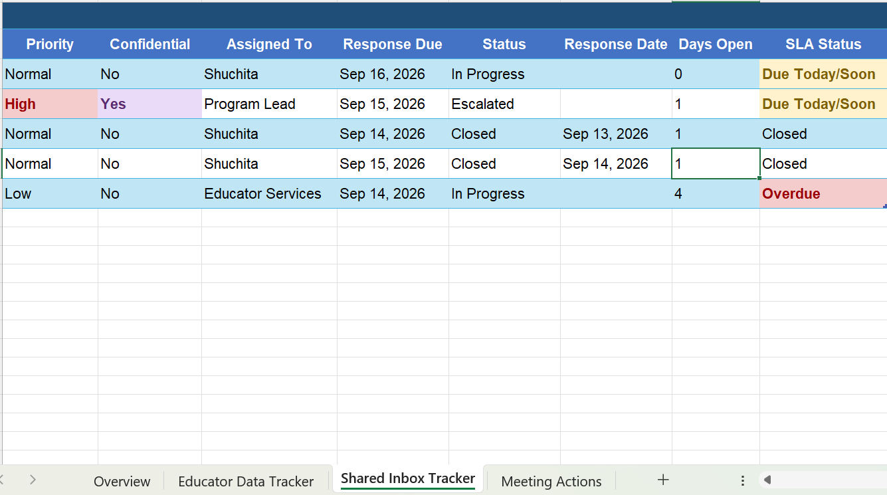

# Excel Administrative Operations Work Sample

An Excel portfolio project demonstrating **administrative data tracking, shared inbox management, meeting follow-up, deadline monitoring, data quality, and confidentiality-aware workflow management** using fictional operational data.

The workbook is designed as a practical administrative support sample and is also structured to remain usable when opened in Google Sheets.

> **Portfolio note:** All educator names, requests, email subjects, meeting details, IDs, and operational information in this project are fictional and were created solely for portfolio demonstration purposes. No real employee, client, learner, or confidential organizational information is included.

---

## Work Sample Preview



---

## Project Overview

This project demonstrates how Excel can be used to organize and monitor common administrative workflows where accuracy, ownership, deadlines, follow-up, and confidentiality are important.

The workbook brings together three day-to-day administrative processes:

1. **Data request tracking**
2. **Shared inbox and response monitoring**
3. **Meeting action and follow-up tracking**

An overview sheet summarizes the current workload so that open items and exceptions can be identified quickly.

---

## Workflow Summary

| KPI | Result |
|---|---:|
| Educator Requests | 5 |
| Complete Requests | 2 |
| Open Inbox Items | 3 |
| Overdue Inbox Items | 1 |
| Open Meeting Actions | 3 |

These summary metrics provide a quick operational view of workload, outstanding follow-up, and items requiring attention.

---

# 1. Educator Data Tracker

The **Educator Data Tracker** demonstrates a structured process for requesting, receiving, checking, and following up on information.

### Information tracked

- Request ID
- Educator
- Program
- Data requested
- Date requested
- Due date
- Date received
- Quality check
- Follow-up requirement
- Owner
- Status
- Days remaining
- Notes
- Confidentiality flag

### Automated status logic

The tracker uses Excel formulas to classify each request as:

- **Complete** — information has been received
- **Overdue** — due date has passed
- **Due Soon** — due within two days
- **Pending** — still within the expected timeline

The **Days Remaining** field provides an additional numerical view of upcoming deadlines.

### Administrative value

This workflow helps demonstrate the ability to:

- Keep requests organized
- Monitor missing information
- Track due dates
- Document follow-up
- Record data-quality checks
- Assign ownership
- Flag confidential records
- Maintain an audit-friendly history of administrative activity

---

# 2. Shared Inbox Tracker

The **Shared Inbox Tracker** demonstrates how incoming requests can be triaged, assigned, monitored, and escalated.

### Information tracked

- Email ID
- Date received
- Sender type
- Subject
- Category
- Priority
- Confidentiality
- Assigned owner
- Response due date
- Status
- Response date
- Days open
- SLA status

### Workflow status

Requests can be tracked through statuses such as:

- In Progress
- Escalated
- Closed

The workbook also uses formula-based SLA monitoring to identify items as:

- **Closed**
- **Overdue**
- **Due Today/Soon**
- **On Track**

### Administrative value

This workflow demonstrates how a shared inbox can be managed so that:

- Requests are assigned to the correct owner
- High-priority items remain visible
- Response deadlines are monitored
- Confidential requests are clearly flagged
- Escalations are documented
- Open items are not lost in the inbox
- Management can quickly identify overdue responses

---

# 3. Meeting Actions

The **Meeting Actions** sheet converts meeting discussions into trackable responsibilities.

### Information tracked

- Meeting date
- Meeting type
- Agenda item
- Decision / notes
- Action item
- Owner
- Due date
- Status
- Completed date
- Follow-up requirement
- Confidentiality flag

### Automated follow-up logic

Formula-based follow-up indicators identify whether an incomplete action is:

- **Overdue**
- **Due Soon**
- Not yet requiring follow-up

Completed actions are automatically marked as not requiring further follow-up.

### Administrative value

This workflow demonstrates the ability to:

- Document meeting decisions
- Convert discussions into clear action items
- Assign responsibility
- Track deadlines
- Follow up on incomplete tasks
- Maintain accountability
- Flag sensitive meeting information appropriately

---

## Workbook Structure

The workbook contains four worksheets:

### `Overview`

Provides:

- Workbook purpose
- Data/privacy notice
- Reviewer guide
- As-of date
- High-level workflow summary

### `Educator Data Tracker`

Tracks information requests, completeness checks, deadlines, ownership, follow-up, and confidentiality.

### `Shared Inbox Tracker`

Tracks incoming requests, priority, assignment, response deadlines, SLA status, escalation, and closure.

### `Meeting Actions`

Tracks decisions, action items, owners, due dates, completion, and follow-up requirements.

---

## Excel Skills Demonstrated

This project demonstrates practical use of:

- Nested `IF` formulas
- `COUNTIF`
- `COUNTA`
- Cross-sheet references
- Date calculations
- Days-remaining calculations
- Formula-based status logic
- SLA monitoring
- Conditional formatting
- Dropdown / controlled-status workflows
- Structured data-entry layouts
- Due-date monitoring
- Exception tracking
- Confidentiality flags
- Summary reporting

---

## Example Workflow Logic

The workbook uses formula-driven rules rather than relying entirely on manually entered status labels.

For example:

**Data requests**

`Received → Complete`

`Past Due → Overdue`

`Due Within 2 Days → Due Soon`

`Otherwise → Pending`

**Shared inbox**

`Closed → Closed`

`Past Response Deadline → Overdue`

`Due Within 1 Day → Due Today/Soon`

`Otherwise → On Track`

**Meeting actions**

`Complete → No Follow-up`

`Past Due → Follow-up Overdue`

`Due Within 2 Days → Follow-up Due Soon`

This creates a more consistent administrative tracking process and makes exceptions easier to identify.

---

## Business / Administrative Relevance

This work sample is designed around responsibilities commonly found in Administrative Assistant, Administrative Coordinator, Program Assistant, Office Support, and similar roles.

It demonstrates the ability to:

- Maintain accurate administrative records
- Organize multiple requests and priorities
- Monitor deadlines and outstanding items
- Manage shared-inbox workflows
- Track ownership and accountability
- Prepare and maintain meeting action logs
- Follow up on incomplete information
- Identify overdue or time-sensitive work
- Support data-quality checks
- Handle confidential information thoughtfully
- Provide management with concise operational status reporting

---

## Data Quality & Maintenance Approach

For consistent administrative reporting, the workbook should be maintained using the following practices:

1. Assign a unique ID to each request or inbox item.
2. Use standardized status, priority, and category values.
3. Enter dates as true Excel dates rather than text.
4. Record the assigned owner for every actionable item.
5. Update completion or response dates promptly.
6. Document important follow-up in the notes field.
7. Review overdue and due-soon items regularly.
8. Perform quality checks before marking information complete.
9. Keep confidentiality flags current.
10. Reconcile the Overview summary with the detailed trackers after major updates.

---

## Confidentiality & Access

All data in this repository is **fictional**.

If a similar workbook were used with real organizational information, appropriate controls would include:

- Storing the workbook only in approved organizational systems
- Restricting access according to job responsibilities
- Applying least-privilege permissions
- Limiting access to confidential records
- Avoiding sensitive information in unnecessary free-text notes
- Reviewing shared-drive or folder permissions regularly
- Using aggregate reporting where detailed information is not required
- Following organizational retention and deletion requirements
- Never placing real confidential records, passwords, credentials, or access tokens in a public GitHub repository

---

## Download the Excel Workbook

➡️ **[Download the Administrative Operations Work Sample](administrative-operations-work-sample.xlsx)**

For the best viewing experience, download the workbook and open it in **Microsoft Excel desktop**.

The workbook is also designed to remain practical when uploaded to Google Drive and opened in Google Sheets, although minor formatting differences may occur.

---

## Repository Contents

```text
excel-administrative-operations-work-sample/
│
├── README.md
├── administrative-operations-work-sample.xlsx
└── 03-administrative-operations.png
```

---

## Portfolio Focus

This project highlights my ability to use Excel to support the full administrative workflow:

**Request Intake → Ownership → Deadline Tracking → Follow-up → Completion → Management Reporting**

It is intended as a practical demonstration of organized, detail-oriented administrative support rather than a purely analytical Excel exercise.

